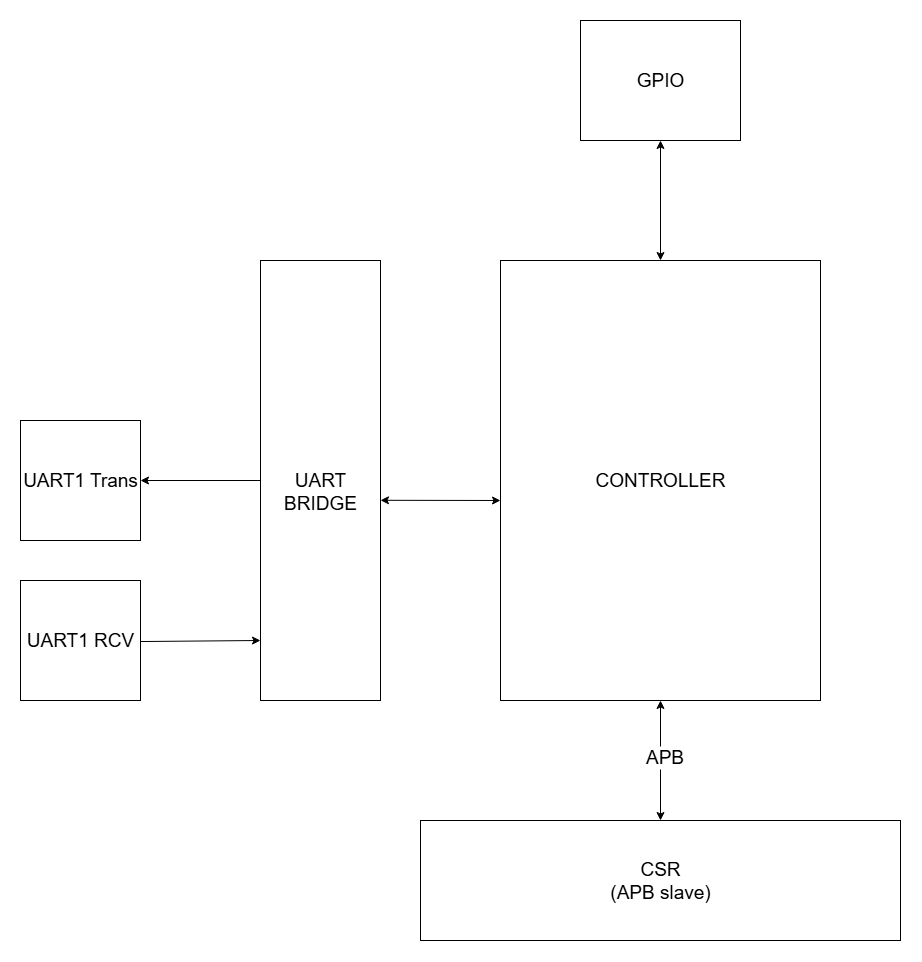

# OneKiwi_PLC

Modbus Converter IP core linking a Linux host running OpenPLC to external
Modbus devices and on-board GPIO. The design is written in plain
Verilog‑2001 and organized for use in FPGA or ASIC flows.



## Overview

OneKiwi_PLC bridges an APB3 CSR interface, UART-connected Modbus devices
and 32-bit GPIO to provide an FPGA/ASIC-ready Modbus Converter. It can
operate as a master or slave, exposing the process image to a Raspberry
Pi running the OpenPLC runtime.

## Features

* APB3 CSR block controlling UART, GPIO and scan engine
* UART RX/TX with 16× oversample, optional parity and 1/2 stop bits
* RTU and ASCII framing with CRC16 or LRC verification
* Autonomous master scan engine for round‑robin polling of remote slaves
* Supports Modbus function codes 01,02,03,04,05,06,0F and 10 in master
  and slave modes
* Synchronous resets only; parameterizable widths and table sizes

## Project Structure

* `src/` – RTL sources
  * `csr_block.v` – APB3 CSR slave exposing configuration and I/O images
  * `uart_rx.v` – 16× oversampling UART receiver with optional parity
  * `uart_tx.v` – matching UART transmitter supporting 1 or 2 stop bits
  * `uart_bridge.v` – RTU/ASCII framer and deframer around the UART
  * `crc16_modbus.v` – CRC16 calculator for Modbus RTU frames
  * `lrc_ascii.v` – Longitudinal Redundancy Check for ASCII mode
  * `gpio_input.v` – double‑flop synchronizer for digital inputs
  * `gpio_output.v` – masked, registered digital output driver
  * `modbus_controller.v` – top‑level protocol state machine
  * `top_modbus_converter.v` – ties APB, UART and GPIO submodules
* `tb/` – self‑checking testbenches
  * `top_modbus_converter_tb.v` – basic CSR and GPIO simulation
* `impl/` – implementation collateral

## Achievements

* End-to-end simulation with Icarus Verilog
* Documentation of IP modules, integration warnings and build steps
* Ready for OpenPLC integration on Raspberry Pi

## Known Issues

* Synthesis support is incomplete: no synthesis scripts or timing
  constraints are provided and initial tool runs show unresolved
  mapping issues
* Software driver for OpenPLC is out of scope
* Advanced Modbus scenarios (broadcast, exceptions) untested

## Warnings / Notes

* For full OpenPLC compatibility you need a driver or userspace module to
  map CSR registers (e.g. via `/dev/mem` or a kernel driver)
* Ensure UART parameters (baud rate, parity, stop bits) match the remote
  Modbus device
* Configure OpenPLC runtime to access the exposed CSR images and poll
  through the UART bridge

## Dependencies

The project relies on open-source EDA tooling for simulation and testing:

* [Icarus Verilog](https://steveicarus.github.io/iverilog/) (`iverilog` and `vvp`) for compiling and running simulations
* A POSIX-like shell environment (for example, Linux) to execute build commands

## Linting

Run Verilator in lint-only mode to catch width mismatches and other RTL issues before simulation:

```sh
verilator --lint-only src/*.v
```

## Build Instructions

Ensure the `build/` directory exists, then compile and run the core:

```sh
mkdir -p build
iverilog -g2001 -s top_modbus_converter -o build/top_modbus_converter.vvp src/*.v
vvp build/top_modbus_converter.vvp
```

To run the provided self-checking testbench:

```sh
iverilog -g2001 -s top_modbus_converter_tb -o build/top_modbus_converter_tb.vvp src/*.v tb/top_modbus_converter_tb.v
vvp build/top_modbus_converter_tb.vvp
```

